## 👋 Rahul Jangir

Infrastructure & Cloud Engineer · Pune, India · ~4+ years in the industry

- ☁️ **Cloud & Infra** — AWS (EC2, VPC, RDS, S3, IAM), Kubernetes, Terraform, Docker, CI/CD pipelines
- 🛠️ **DevOps** — GitHub Actions, Helm, Grafana, Prometheus, CloudWatch, Linux server management
- � **Full-Stack** — .NET, Angular, Next.js, TypeScript, SQL Server, REST APIs
- 🏠 **Homelab** — Proxmox, K3s, OpenWrt, OpenMediaVault — test before production

---

### 🔗 Connect

---

### 🧰 Tech Stack

**Infrastructure & Cloud**

<a title="RHEL" href="#">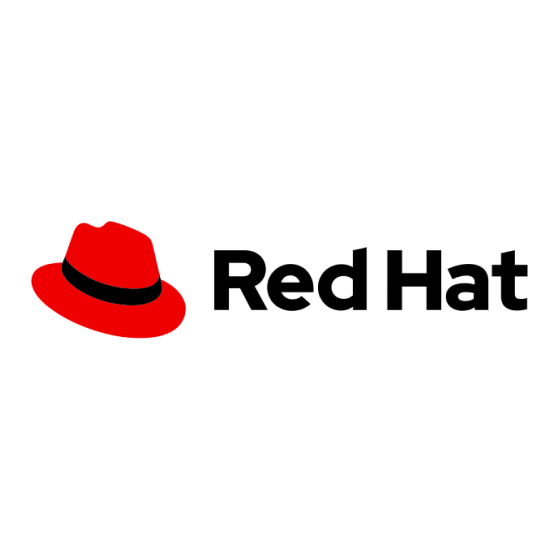</a>

<a title="Docker" href="#">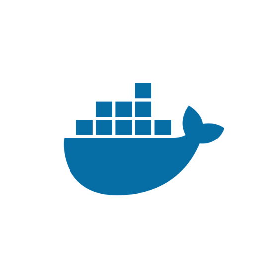</a>
<a title="Kubernetes" href="#">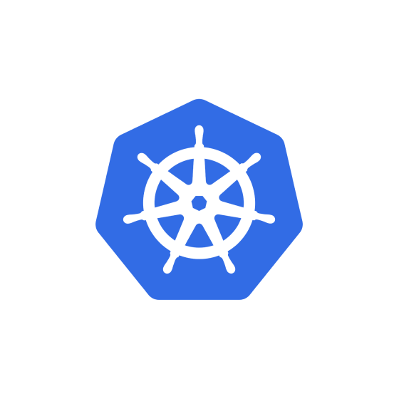</a>

<a title="GitHub Actions" href="#">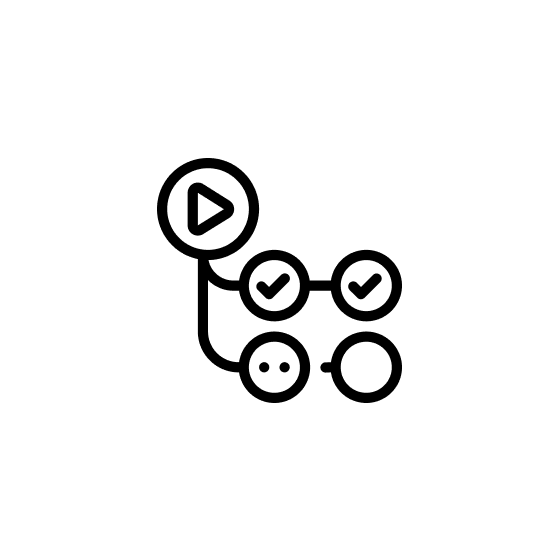</a>
<a title="Terraform" href="#">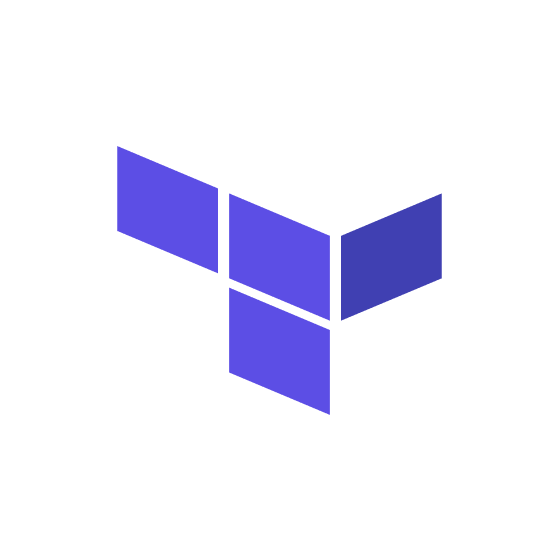</a>
<a title="Git" href="#">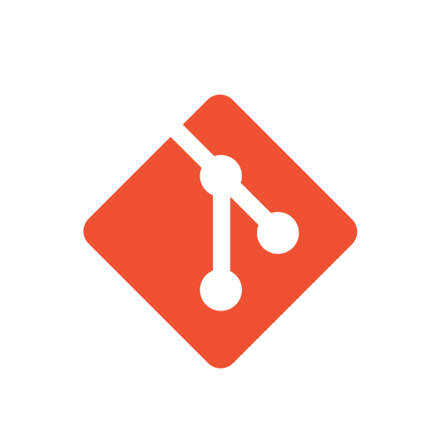</a>

<a title="CloudWatch" href="#">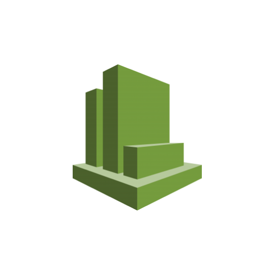</a>

**Software Development**

<a title=".NET" href="#">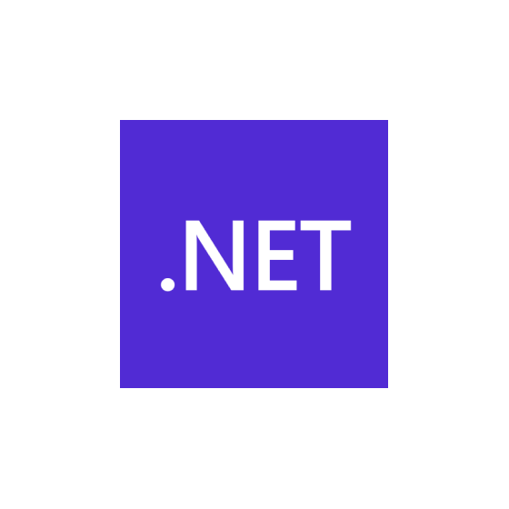</a>
<a title="C#" href="#">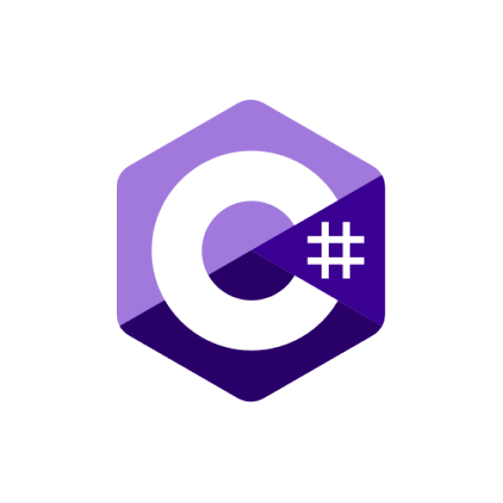</a>
<a title="Node.js" href="#">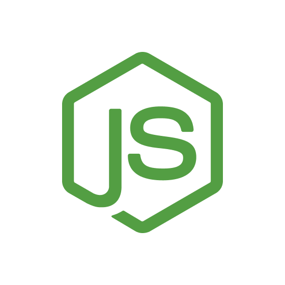</a>

<a title="C++" href="#">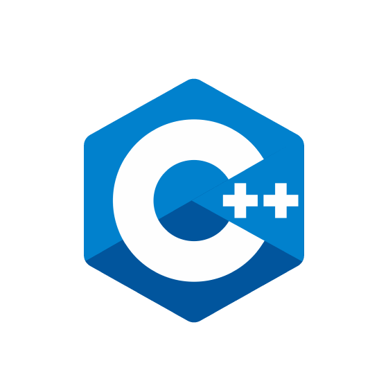</a>
<a title="Angular" href="#">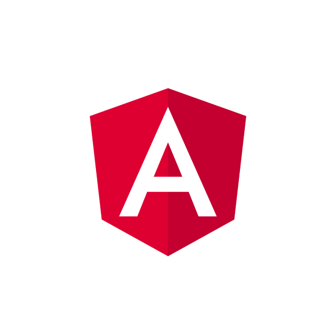</a>

<a title="TypeScript" href="#">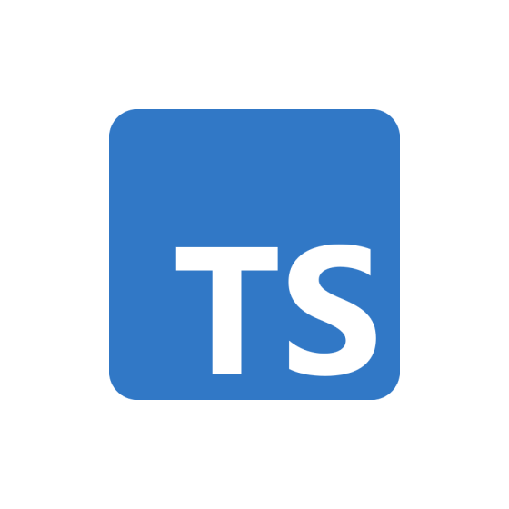</a>
<a title="JavaScript" href="#">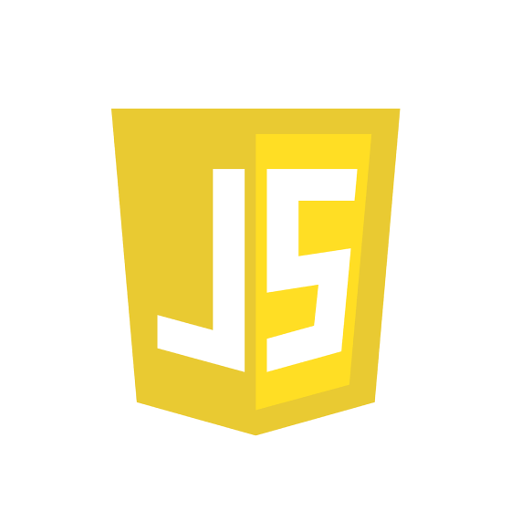</a>

<a title="CSS" href="#">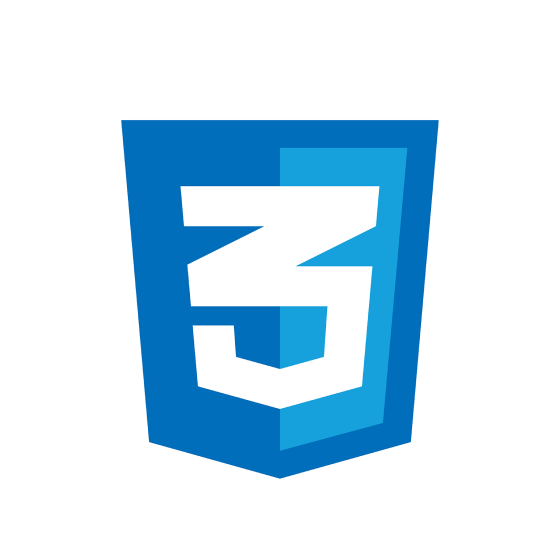</a>

---

### 📊 GitHub Stats

---

### 👷 Currently working on

- [rahuljangirworks/rahul-boilerplate](https://github.com/rahuljangirworks/rahul-boilerplate) - A production-ready full-stack boilerplate featuring React Router v7 (SSR), Better Auth, tRPC v11, Drizzle ORM (Turso), and Tailwind CSS v4.
- [rahuljangirworks/sadabahar-ui](https://github.com/rahuljangirworks/sadabahar-ui) - 

### 🌱 Latest projects

- [rahuljangirworks/sadabahar-ui](https://github.com/rahuljangirworks/sadabahar-ui) - 
- [rahuljangirworks/rahul-boilerplate](https://github.com/rahuljangirworks/rahul-boilerplate) - A production-ready full-stack boilerplate featuring React Router v7 (SSR), Better Auth, tRPC v11, Drizzle ORM (Turso), and Tailwind CSS v4.
- [rahuljangirworks/mission-control-3](https://github.com/rahuljangirworks/mission-control-3) - 워크스페이스 프로젝트 관제 대시보드 — Next.js &#43; GitHub API
- [rahuljangirworks/background](https://github.com/rahuljangirworks/background) - nord-background
- [rahuljangirworks/encryption-decryption](https://github.com/rahuljangirworks/encryption-decryption) - A secure, production-ready encryption/decryption microservice built with Node.js and TypeScript.

### 🔨 Recent Pull Requests

### ⭐ Recent Stars

- [ogulcancelik/herdr](https://github.com/ogulcancelik/herdr) - agent multiplexer that lives in your terminal.
- [dodopayments/dualmark](https://github.com/dodopayments/dualmark) - Open-source AEO (Answer Engine Optimization) infrastructure — every page, dual-marked. Markdown twins for AI agents alongside HTML for humans, picked by HTTP content negotiation.
- [dodopayments/billingsdk](https://github.com/dodopayments/billingsdk) - Modern Billing &amp; Monetization UI Components Library
- [yepengfan/obsidian-workflow](https://github.com/yepengfan/obsidian-workflow) - Obsidian vault workflow system: book learning, Claude Code commands, templates
- [nainglinnkhant/shadcn-view-table](https://github.com/nainglinnkhant/shadcn-view-table) - Shadcn table component with server side sorting, pagination, filtering, and custom views. This is built on top of @sadmann17&#39;s shadcn-table.
